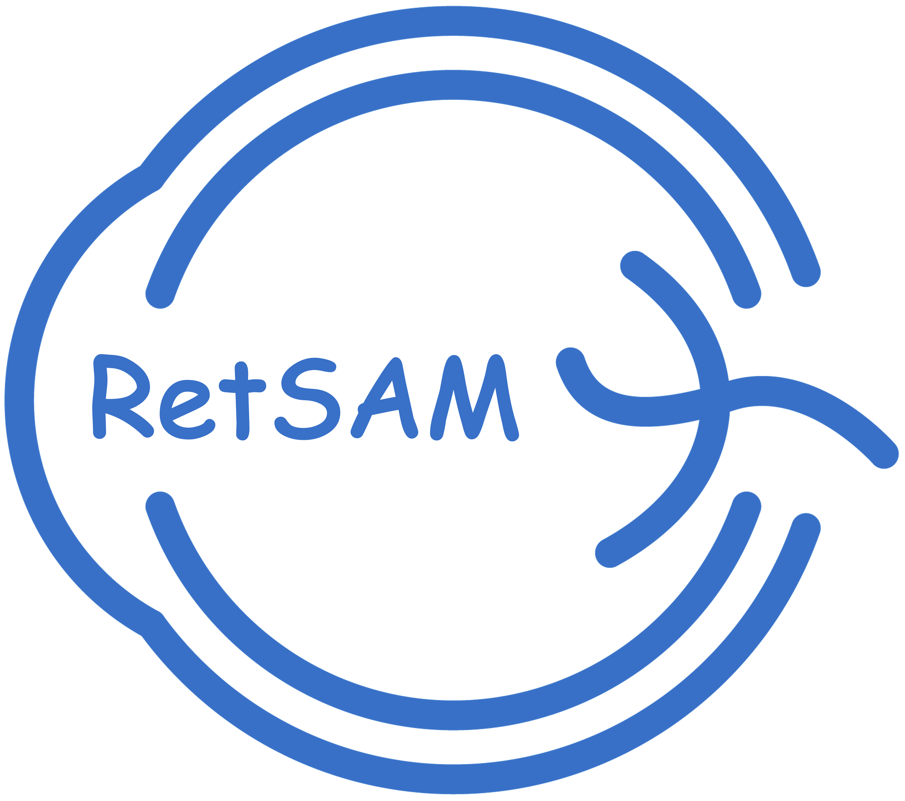

<p align="center">
  
</p>

# RetSAM

<p align="left">
  <a href="https://arxiv.org/abs/2602.07012"></a>
  <a href="https://wzhjerry.github.io/RetSAM/"></a>
  <a href="https://huggingface.co/JerryWzh/RetSAM_public"></a>
</p>

Overview
--------
This is the official repository of "A General Model for Retinal Segmentation and Quantification". 

For questions about RetSAM, this repository, or full-access models, please contact Zhonghua Wang at `zhonghua.wang@monash.edu`.

> **Note (important)**: Due to data policy and privacy constraints, the publicly released models are trained on public datasets and may show performance differences from the models reported in the paper. For questions about RetSAM, this repository, or full-access models, please contact Zhonghua Wang at `zhonghua.wang@monash.edu`.

> **License notice**: This repository is licensed under `PolyForm Noncommercial 1.0.0`. Commercial use is not permitted under this license. If you need commercial licensing, please contact the author.

Repository Layout
-----------------
- `main.py` – simple Python API wrapper (`RetSAM`).
- `run.py` – training/testing entry (argparse, wandb/CSV logging, calls `workers/train.py` and `workers/test.py`).
- `inference.py` – CLI entry for inference.
- `inference_modules/` – model loading, preprocessing, predictor, visualizer, analyzer, disease grading.
- `models/` – Lightning modules and Swin-based multitask models.
- `datasets/` – dataset loaders (add your own for finetune).
- `scripts/` – helper scripts (`inference.sh`, `train.sh`).
- `utils/` – training utils, visualization, analysis helpers.

Requirements
------------
- Python 3.8+
- Core GPU stack (cu121): `torch==2.5.1+cu121`, `torchvision==0.20.1+cu121`, `torchaudio==2.5.1+cu121`, `triton==3.1.0`
- Training/runtime: `lightning==2.5.5`, `pytorch-lightning==1.9.5`, `monai==1.5.0`, `timm==1.0.20`, `segmentation_models_pytorch==0.5.0`, `torchmetrics==0.10.3`
- Data/IO/processing: `numpy==2.1.2`, `scipy==1.15.3`, `pandas==2.3.2`, `scikit-image==0.25.2`, `opencv-python==4.12.0.88`, `pillow==11.0.0`, `tqdm==4.67.1`, `matplotlib==3.10.6`
- Medical/analysis: `MedPy==0.5.2`, `simpleitk==2.5.2`
- Optional: `wandb==0.22.0` for experiment logging
Install with your preferred environment manager, e.g.:
```bash
pip install -r requirements.txt
# or install the key deps manually; ensure torch matches your CUDA.
```

Introduction
------------
<p align="center">
  
</p>

RetSAM is a multitask retinal segmentation and quantification model that provides:
- Multi-head segmentation (artery/vein, OD/OC, tessellation, myopia, lesion variants).
- Optional coordinate prediction head
- Inference pipeline with visualization overlays and quantitative analysis outputs (JSON).
- Disease-oriented post-analysis (e.g., DR, glaucoma, AMD, myopia, cataract proxies).
- Training/finetuning scripts to adapt to new datasets and channel configurations.

Segmentation Task Setup
-----------------------
> **Public release scope**: Due to private-data policy constraints, the public RetSAM release currently provides quantitative outputs for artery/vein, OD/OC, tessellation, myopia, and four lesion categories: hemorrhage, exudate, cotton wool spot, and drusen. If you are interested in the full-access RetSAM models and task set, please contact Zhonghua Wang at `zhonghua.wang@monash.edu`.
- Anatomical structures: vessels (artery, vein); optic nerve (optic disc, optic cup).
- Phenotypes: tessellation.
- Myopic features: peripapillary atrophy, diffuse atrophy, patchy atrophy.
- Lesions (DR): hemorrhage, exudates, cotton wool spots, laser spot.
- Lesions (AMD): drusen, patchy hemorrhage.
- Lesions (other): epiretinal membrane, macular hole, artifacts, retinal scar.
- Possible lesions: additional fundus findings (e.g., edema, arteriovenous nicking, venous beading, vascular sheathing, pigmentary changes, fibrous proliferation, vitreous degeneration).

Quantitative Outputs
--------------------
- Retinal vessels: A/V ratio; CRAE/CRVE; fractal dimension (FD_a, FD_v); tortuosity.
- Optic disc/cup/macula: horizontal/vertical CDR; ISNT rim widths; disc/cup orientation angle; foveal coordinates; disc/cup areas.
- Tessellation: coverage ratio; shape descriptors (circularity, aspect ratio); centroid dispersion.
- Pathological myopia: counts/area/coverage for diffuse/patchy/PPA; global coverage of myopia-related changes.
- Lesions: per-category load (count/area/coverage); size distribution (small/medium/large); shape morphology (circularity, aspect ratio); quadrant localization; severity grading.

Quick Start (Inference)
-----------------------
Option A: Python API
```python
from main import RetSAM

retsam = RetSAM(model_path="path/to/ckpt.ckpt", device="cuda")
result = retsam.inference(
    img_path="path/to/image.png",
    save_path="./outs",
    visualization=True,
    analysis=True,
)
# Outputs (masks/visualizations/analysis) are written to save_path if enabled.
```
Switches: `visualization=False` skips visual overlays; `analysis=False` skips quantitative analysis; both False -> no masks/visuals/analysis saved.

Option B: Script
```bash
bash scripts/inference.sh \
  # edit the script to set --input_dir, --output_dir, --model_path, etc.
```
Outputs (masks/visualizations/analysis) go to `--output_dir` per image.

Example output structure (`--output_dir /path/to/outs`):
```
/path/to/outs
├─ image_001/
│  ├─ masks/
│  │  ├─ artery_vein.png
│  │  ├─ od_oc.png
│  │  ├─ tessellation.png
│  │  ├─ myopia.png
│  │  └─ lesion_*.png
│  ├─ visualizations/
│  │  ├─ combined_overlay.png
│  │  ├─ artery_vein_overlay.png
│  │  └─ ...
│  ├─ quantitative_analysis.json
│  └─ disease_classification.json   # only if --classify_diseases
└─ image_002/
   └─ ...
```

Batch Inference
---------------
1) Edit `scripts/inference.sh` to set paths and flags.
2) Run:
```bash
bash scripts/inference.sh
```
Outputs are saved under `--output_dir` per image. The script recurses over common image extensions in `--input_dir`.
- Minimal knobs to edit:
  - `--input_dir`: input folder (required).
  - `--output_dir`: output folder (required).
  - `--model_path`: checkpoint path (required).
  - `--output_channels`: tuple string, default `"(2,3,2,4,5)"`; match your checkpoint heads.
  - `--has_coordinate_head`: enable coordinate head if your checkpoint includes it.
  - `--num_coordinates`: number of coordinates (e.g., `2` for one point).
  - `--enable_analysis`: write `quantitative_analysis.json`.
  - `--classify_diseases`: enable disease grading (requires `--enable_analysis`).
  - `--disease_types`: list of diseases (default all supported).
  - `--binary_masks_only`: save 0/255 masks only.
  - `--analysis_only`: analysis only, no visualization saving.
  - `--device`: `cuda` or `cpu` (default `cuda`).
  - `--image_extensions`: comma-separated list (default `"jpg,jpeg,png,bmp,tiff"`).

Fine-tuning
-----------
1) Datasets: add/modify a loader under `datasets/` (e.g., `datasets/your_dataset.py`), implement `load_dataset(args, train=True/False)`, and set your local paths, splits, transforms. The `--dataset` argument must match the filename (without `.py`).
2) Configure training in `scripts/train.sh` (batch size, lr, save paths, checkpoint, etc.).
3) Run:
```bash
bash scripts/train.sh
```
Models/logs are saved under `--save_name`. Fine-tuning is multitask-only; use `swin_multitask` by default (or `swin_multitask_final` if you have that checkpoint).
- Minimal knobs to edit (multitask only):
  - `--dataset`: loader name (must match file in `datasets/`).
  - `--save_name`: output dir for checkpoints/logs.
  - `--pretrained`: path to multitask checkpoint.
  - `--train_csv_name`: training list filename (default `train.csv`).
  - `--csv_base_dir`: base directory for CSV lists and dataset paths.
  - `--dataset_name`: optional explicit dataset folder name.
  - `--model`: `swin_multitask` (default) or `swin_multitask_final`.
  - `--out_channels`: tuple string, default `"(2,3,2,4,5)"`; change length to alter task count, values = classes per task.
  - `--size`: input resolution (default `640`).
  - `--gpu`: device ids string. Single GPU: set `'1'`; multi-GPU: set the ids, e.g., `'0,1,2,3'`.
  - `--kfold`: enable 5-fold training.
  - `--resume`: fold id to resume (default `-1`).
  - `--evaluate`: run evaluation only.
  - `--debug`: use CSV logger instead of Wandb.
  - `--log_name`, `--tags`, `--description`, `--id`: Wandb logging controls.
  - `--class_weights`, `--seed`: loss weights and random seed.

To-do
-----
- [ ] Add single-task inference support.
- [ ] Add CSV export for quantitative analysis results.
- [ ] Release RetSAM variants with different parameter scales.
- [ ] Release higher-resolution RetSAM models.

License
-------
This repository is distributed under `PolyForm Noncommercial 1.0.0`.

That license permits personal, educational, academic, research, evaluation, and other non-commercial uses. Commercial use is not permitted under this license.

If you need commercial licensing, please contact: `zhonghua.wang@monash.edu`

Citation
--------
```bibtex
@article{wang2026general,
  title={A General Model for Retinal Segmentation and Quantification},
  author={Wang, Zhonghua and Ju, Lie and Li, Sijia and Feng, Wei and Zhou, Sijin and Hu, Ming and Xiong, Jianhao and Tang, Xiaoying and Peng, Yifan and Lin, Mingquan and others},
  journal={arXiv preprint arXiv:2602.07012},
  year={2026}
}
```
